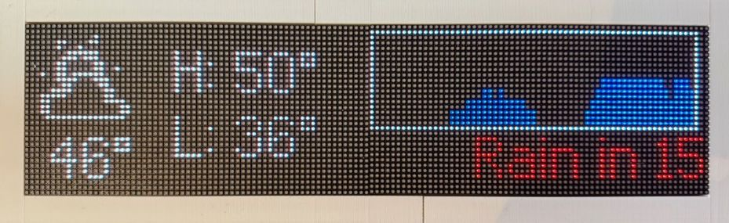
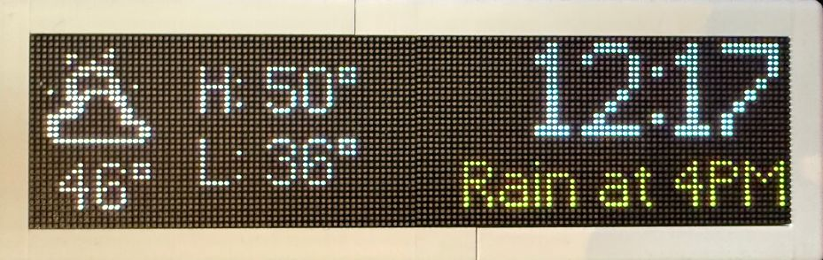

# ESPHome Weather Display Board

Inspired by the [Transit Tracker](https://transit-tracker.eastsideurbanism.org) project, this extends it's functionality by adding a display page showing important weather information for your travels that day.

## Requirements
- A built display board. See Transit Tracker's excellent [build guide](https://transit-tracker.eastsideurbanism.org/docs/build-guide)
- [ESPHome Device Builder](https://esphome.io/guides/getting_started_hassio/) environment. If you have docker setup, you can use the `start-esphome.sh` script to run the installer dashboard.
- [Home Assistant](https://www.home-assistant.io/) setup with the [OpenWeatherMap integration](https://www.home-assistant.io/integrations/openweathermap) in One Call API 3.0 mode.
- Knowledge of building/installing ESPHome firmware, Home Assistant blueprint importing, and Home Assistant configuration yamls.

## Home Assistant Setup
Due to current limitations in Home Assistant, there's a few steps you must take.
First add [ha/input_number.yaml](ha/input_number.yaml) and [ha/input_text.yaml](ha/input_text.yaml) to your Home Assistant's `configuration.yaml` and reload your yamls. These will add the intermediary helpers used by the Blueprint and the ESPHome firmware.
Next import the [ha/openweatherblueprint.yaml](ha/openweatherblueprint.yaml) Blueprint into Home Assistant.
If everything is setup correctly, you should see a few entries under the Helpers tab such as `next_hour_rain_description` and `today_high_temp` which will be populated with current values.

## ESPHome Setup
If you're adding this to an existing ESPHome firmware, look at [weatherboard_example.yaml](weatherboard_example.yaml) for what to merge into your existing yaml.  
If you plan on using this with Transit Tracker, look at [transit_weatherboard_example.yaml](transit_weatherboard_example.yaml) for a near complete firmware yaml based on v2.7.1. You'll just need to add a `secrets.yaml` with your wifi information and the `transit_tracker` yaml blob from the Transit Tracker [configurator](https://transit-tracker.eastsideurbanism.org/configurator). You can then control what is being displayed with the button controls in Home Assistant.
