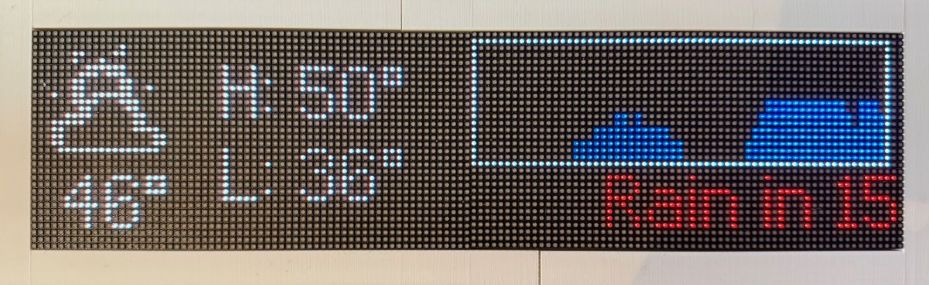
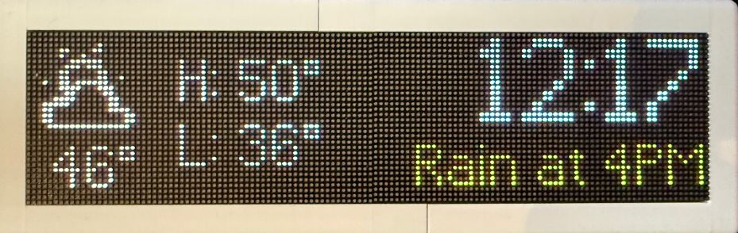

# ESPHome Weather Display Board

Inspired by the [Transit Tracker](https://transit-tracker.eastsideurbanism.org) project, this extends it's functionality by adding a display page showing important weather information for your travels that day.




## Requirements

- A built display board. See Transit Tracker's excellent [build guide](https://transit-tracker.eastsideurbanism.org/docs/build-guide)
- [ESPHome Device Builder](https://esphome.io/guides/getting_started_hassio/) environment. If you have docker setup, you can use the `start-esphome.sh` script to run the installer dashboard.
- [Home Assistant](https://www.home-assistant.io/) integration is now optional for controlling the device (page-switching, configuration) via the ESPHome API. **Weather is processed entirely on the device** — the firmware fetches the OpenWeatherMap One Call 4.0 API (split across 4 endpoints: current, 1-min, 1-hour, and 1-day timelines) and the AirNow AQI endpoint directly from the ESP32, with no Home Assistant integration required for weather. Two tiered fetch intervals keep API usage under the 1,000-call/day free tier: a 3-minute now-cast (current + 1-min rain graph) and a 15-minute forecast (1-hour summary + 1-day H/L + AQI). Both intervals skip automatically when the `Display Brightness` light is off.
- Knowledge of building/installing ESPHome firmware.

## ESPHome Transit + Weatherboard Setup

Create a new firmware yaml with

```
packages:
  transit_weatherboard: github://mixtythepuppycat/esphome-weatherboard/firmware/transit-weatherboard.yaml@main

transit_tracker:
  See https://transit-tracker.eastsideurbanism.org/configurator for configuration values 
  font_id: pixolletta   # forwarded to the upstream package

```

You may need to download and place [weather_logic.h](https://github.com/mixtythepuppycat/esphome-weatherboard/blob/master/firmware/weather_logic.h) in your firmware build directory


Additionally add the following to your `secrets.yaml`:

```
wifi_ssid: <YOUR_WIFI_SSID>
wifi_password: <YOUR_WIFI_PASSWORD>
owm_api_key: <YOUR_OPENWEATHERMAP_API_KEY>
owm_lat: <YOUR_LATITUDE>
owm_lon: <YOUR_LONGITUDE>
airnow_api_key: <YOUR_AIRNOW_API_KEY>
```

`owm_api_key` is your OpenWeatherMap One Call 4.0 key. The free tier covers
~1,000 calls/day; the firmware's tiered polling (3-min now-cast + 15-min
forecast, both gated on display power) stays under that limit at ~912 calls/day 
(assuming you turn your display off at night for at least 5 hours).
Fetch an appid at [openweathermap.org](https://openweathermap.org/api/).
`airnow_api_key` is your separate AirNow API key for AQI
(does not count toward the OWM limit), which you can get at
[docs.airnowapi.org](https://docs.airnowapi.org/). `owm_lat`/`owm_lon` are shared
between the OWM and AirNow requests.

You can switch between the weather and transit information using the ESPHome web
dashboard's switches (or optionally, Home Assistant entities if you connect the
device via the ESPHome API).